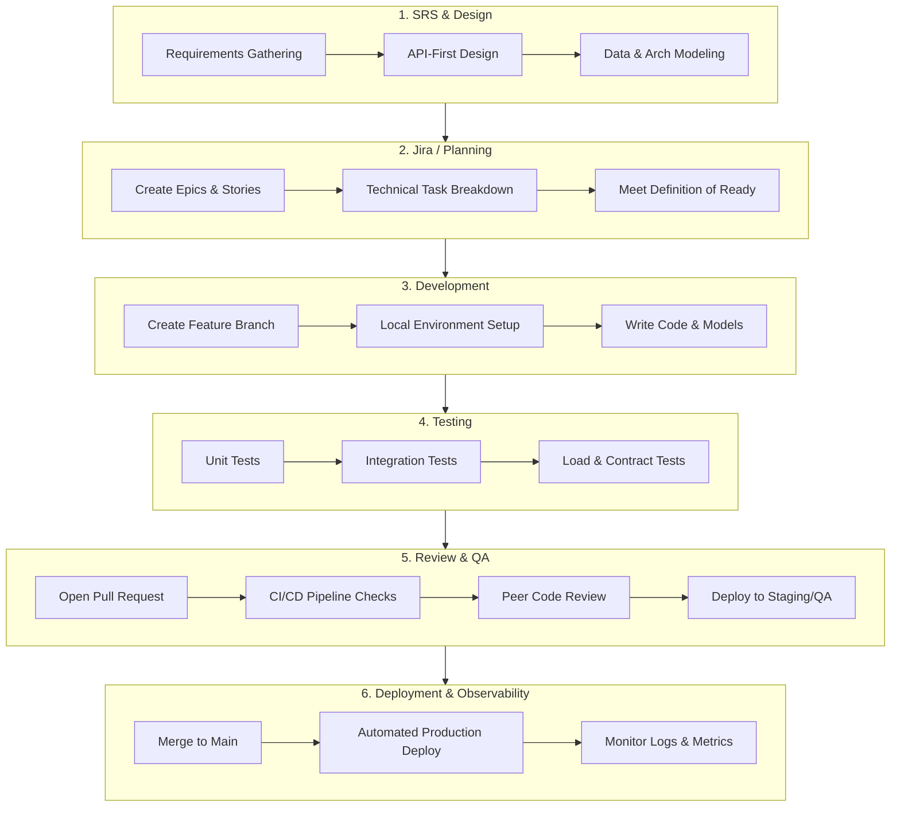

# Backend Development Workflow

This document outlines the standard Software Development Life Cycle (SDLC) for backend features, ensuring quality, scalability, and maintainability.

## 1. SRS (Software Requirements Specification) & Design
**Goal:** Define what to build and the technical architecture before writing any code.

- **Requirements Gathering:** Define functional and non-functional requirements (throughput, latency, data compliance).
- **API-First Design:** Create API contracts (e.g., OpenAPI/Swagger specs) so frontend and backend teams can work in parallel.
- **Data Modeling:** Design Entity-Relationship Diagrams (ERDs) and finalize database schemas.
- **Architecture:** Map interactions with external services, message queues, and caching layers.
- **Security:** Identify security constraints (authentication, authorization, data privacy).

## 2. Jira (Planning & Task Breakdown)
**Goal:** Translate requirements into trackable, actionable tasks.

- **Epics & Stories:** Break the SRS down into business-value Epics and User Stories.
- **Technical Sub-tasks:** Break stories into backend-specific tasks:
  - Database schema migrations
  - API endpoint implementation
  - Business logic/domain models
  - Unit and Integration tests
- **Definition of Ready (DoR):** Ensure every ticket has clear acceptance criteria, API contracts, and necessary designs attached before development begins.

## 3. Development
**Goal:** Write clean, modular code following architectural standards.

> [!IMPORTANT]
> **🛡️ Mandatory Gate: "No Plan, No Code"**  
> Development **CANNOT** start without an approved Task Plan and Jira ticket (`PROJ-xxx`) linked to an approved SRS document. Code generation requests lacking a ticket or SRS must be halted and directed to Stage 1 & 2.

- **Branching:** Follow a version control strategy (e.g., GitFlow). Branch off from `main` or `develop` (e.g., `feature/PROJ-101-user-auth`).
- **Local Environment & Dual Config:**
  - Spin up local MongoDB (`27017`) and RabbitMQ (`5672` / `15672` Management UI) via `docker compose -f docker-compose.infra.yml up -d`.
  - Local development runs directly from `appsettings.Development.json` (pointing to `localhost` Mongo and RabbitMQ) with zero external file dependencies.
- **Persistence & Repositories:** 
  - Write Side: `ITransactionalRepository` / `IAggregateRootRepository<T>` targeting `{{ServiceId}}_write_db`.
  - Read Side: `IReadRepository` targeting `{{ServiceId}}_read_db`.
  - Saga State: `IStateRepository` targeting `{{ServiceId}}_saga_state_db`.
  - Deployed environments dynamically resolve these connections via OS-independent `ServiceRegistrations.json`.
- **Implementation:** 
  - Follow CQRS, DDD, and Clean Architecture patterns adhering to the 10 core rules in `general-rules.md`.
  - Follow canonical skeletons in `.ai/templates/` and wire DI via `.ai/di-registration-guide.md`.
- **Commit Early & Often:** Use conventional commits for descriptive version history.
- **Living Flow Documentation:** Update or create `.ai/flows/<feature>.md` (using `.ai/flows/template.md`) detailing key components, decisions, touched files, and status.

## 4. Test (Automated & Manual)
**Goal:** Validate that the code behaves correctly and performs efficiently.

- **Unit Testing:** Isolate and test individual domain logic and services (mocking external dependencies).
- **Integration Testing:** Test interactions with the database and external APIs (using Testcontainers or local instances).
- **Load/Performance Testing:** Verify endpoints can handle expected traffic loads without degradation.
- **Contract Testing:** Ensure the API matches the predefined OpenAPI specifications.

## 5. Review (Code Review & QA)
**Goal:** Ensure code quality, security, and knowledge sharing.

- **Pull Requests (PR):** Open a PR for peer review. Reviewers should check for logic flaws, architectural adherence, and edge cases.
- **CI/CD Checks:** Automated pipelines must pass (linting, tests, build).
- **Definition of Done (DoD):** Code is reviewed, tests are passing, and the living flow doc (`.ai/flows/<feature>.md`) is updated.
- **Staging/QA:** Code is merged into a staging environment for manual Quality Assurance (QA) and API testing (e.g., Postman collections).

## 6. Deployment & Observability
**Goal:** Safely release the feature and monitor its health in production.

- **Automated Deployment:** Use CI/CD to deploy to production reliably.
- **Database Migrations:** Run migrations safely (preferably backward compatible) during deployment.
- **Monitoring & Logging:** 
  - Monitor logs for exceptions.
  - Track metrics (CPU, memory, database query times).
  - Setup alerts for failure spikes or latency issues.

---

## Workflow Diagram

