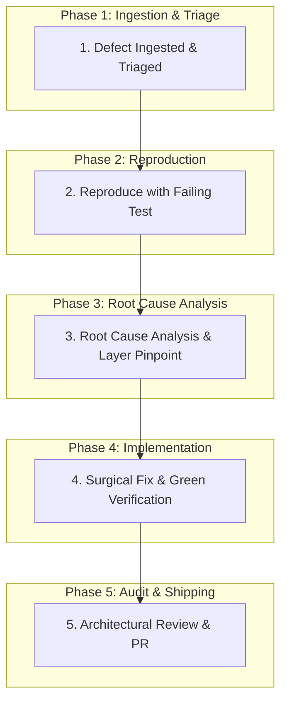

# 🐛 Standard Bug Resolution Procedure: From Defect to Verified Fix

This document defines the authoritative, step-by-step procedure for investigating, reproducing, fixing, and verifying bugs in this DDD/CQRS/Event-Driven backend architecture.

---

## 🧭 The Golden Rule of Bug Fixing
> **NEVER write a fix without first writing a failing test that reproduces the bug.**  
> If there is no test proving the bug exists, there is no proof the bug is fixed, and no protection against future regressions.

---

## 📊 The 5-Phase Bug Resolution Lifecycle



---

## Phase 1: Defect Ingestion & Classification

When a defect is reported (via Jira ticket, error log, or OpenTelemetry trace), classify it into one of the 4 architectural categories:

| Category | Typical Symptom | Affected Layer | Investigation Starting Point |
| :--- | :--- | :--- | :--- |
| **1. Domain Invariant Bug** | Business rule bypassed, invalid state saved, wrong calculations. | `src/Domain/Aggregates/` | Check Aggregate factory/methods and invariant guards. |
| **2. Command / Validation Bug** | Malformed input accepted, command handler failure, missing error response. | `src/Application/` | Check FluentValidators and `ICommandHandlerAsync<T>`. |
| **3. Projection / Event Bug** | Read models out of sync, view models missing fields, projection updates failing. | `src/Read/EventHandlers/` | Check `IEventHandlerAsync<T>`, MongoDB projection filters, and idempotency. |
| **4. Bus / Transport Bug** | Messages stuck in error queues (`_error`), deserialization failures, timeouts. | `src/**/Program.cs` & `SharedDto` | Check MassTransit consumer registration and message contracts. |

---

## Phase 2: Reproduce with a Failing Test (Test-Driven Bug Fixing)

Before modifying any source code, write a targeted test that replicates the reported failure:

### For Domain Invariant / State Bugs:
Add a new unit test in `tests/Aggregates.UnitTest/`:
```csharp
[Fact]
public void Category_WhenDeactivated_ShouldNotAllowProductAddition()
{
    // Arrange
    var category = Category.Create(Guid.NewGuid(), "Electronics", "tenant-1");
    category.Deactivate();

    // Act
    var action = () => category.AssignProduct(Guid.NewGuid());

    // Assert: Must fail initially before the fix
    action.Should().Throw<BusinessViolationException>()
          .WithMessage("*cannot add products to inactive category*");
}
```

### For Integration / Event Flow / Projection Bugs:
Add a test in `tests/ProjectTemplate.IntegrationTest/`:
```csharp
[Fact]
public async Task UpdateCategory_WhenEventConsumed_ShouldUpdateReadProjection()
{
    // Replicate exact sequence that produces the bug
    // Assert projection state fails prior to the fix
}
```

**Verification:** Run `dotnet test` and confirm the test **FAILS** with the expected error.

---

## Phase 3: Root Cause Analysis (Layer Checklist)

Check the underlying layer to understand **why** the defect occurred:

1. **Did an Aggregate state bypass validation?**
   - Check if an entity property was modified directly instead of through a domain method.
   - Check if `AddDomainEvent()` was called with corrupted data.
2. **Did a Projection fail silently?**
   - In MongoDB, check if `ReplaceOneAsync` or `UpdateOneAsync` used an overly strict filter that matched 0 documents.
   - Check if an event handler lacked an `upsert: true` option on first write.
3. **Did a Tenant boundary leak?**
   - Verify every query and command validates the `TenantId` against the user's claims.
4. **Is there an unhandled MassTransit exception?**
   - Check if the consumer threw an exception, causing RabbitMQ to shunt the message to the `.error` queue.

---

## Phase 4: Surgical Implementation & Verification

Apply the fix following platform rules:

1. **Surgical Scope:** Modify **only** the code directly responsible for the defect. Do not perform unrelated refactoring.
2. **Preserve Contracts:** Do not break existing API or event contracts. If adding fields, ensure backward compatibility (`[BsonIgnoreExtraElements]` and nullable properties).
3. **Structured Logging:** Ensure any business violations or unexpected exceptions log structured details:
   ```csharp
   _logger.LogWarning("Failed to deactivate category {CategoryId} for tenant {TenantId}: already inactive", id, tenantId);
   ```
4. **Verify the Fix:**
   ```bash
   # 1. Run the reproduction test — it must now PASS
   dotnet test --filter "Category_WhenDeactivated_ShouldNotAllowProductAddition"

   # 2. Run all unit and integration tests to ensure ZERO regressions
   dotnet test
   ```
5. **Update Living Flow Doc:** Add a note in `.ai/flows/<feature>.md` under `## Decisions Made` noting the bug, root cause, and fix.

---

## Phase 5: Review & Shipping

1. **Architectural Review (`code-reviewer.md`):**
   - Verify the 10 core architectural rules were not violated during the fix.
   - Confirm the reproduction test is included in the PR diff.
2. **Create Pull Request:**
   - Use conventional commit: `fix(<module>): [TICKET-KEY] <description of fix>`
   - Example:
     ```bash
     git checkout -b fix/PROJ-108-inactive-category-assignment
     git add -A
     git commit -m "fix(catalog): [PROJ-108] prevent product assignment to inactive categories"
     git push -u origin fix/PROJ-108-inactive-category-assignment
     gh pr create --title "fix(catalog): [PROJ-108] prevent product assignment to inactive categories" --body "Resolves PROJ-108. Adds reproduction unit test and invariant guard."
     ```
3. **Update Sprint Tracker:** Update the ticket row in `docs/planning/sprint-*-tracker.md` to `🟢 Done`.

---

## 💬 Prompts to Trigger Bug Resolution in Agents

### In Google Antigravity:
```text
Act as @bug-fixer.md to resolve bug [TICKET-KEY]:
"When deactivating a category, existing products still accept assignments."

1. Write a failing reproduction unit test in tests/Aggregates.UnitTest/.
2. Run dotnet test to prove reproduction.
3. Apply the surgical fix in src/Domain/Aggregates/Category.cs.
4. Run dotnet test to verify both the fix and zero regressions.
5. Update .ai/flows/category.md with the root cause and resolution.
```

### In Claude Code:
```bash
claude "Act as the bug fixer in .agents/roles/bug-fixer.md. Resolve bug [TICKET-KEY]: 'Products can be assigned to inactive categories'. First write a failing unit test reproducing the defect in tests/Aggregates.UnitTest/. Then apply the minimal fix in Domain/Aggregates, verify all tests pass, and report findings."
```

